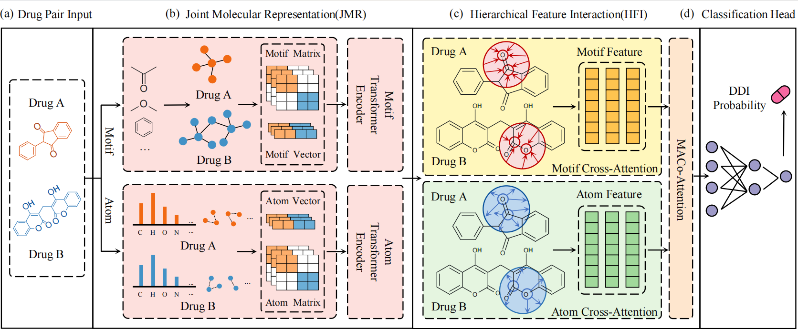

# MS-DDI: A Multi-Scale Representation Learning Approach for Drug-Drug Interaction Prediction

## Abstract
Accurate prediction of drug–drug interaction (DDI) is essential for preventing adverse events. Most existing studies encode drugs separately and then model their relationships, and they often overlook the importance of the joint chemical context and the hierarchical relationship between atom-level and motif-level structures. To address this, we present a framework called MS-DDI, which is based on multi-scale molecular representation to predict DDI. We propose a Joint Molecular Representation (JMR) module that seamlessly integrates different drugs into a unified computational framework while preserving the inherent topological structure of individual drugs, which facilitates the transformer’s learning of multi-scale features. Additionally, to enable deep interaction across hierarchical features, we propose a Hierarchical Feature Interaction (HFI) module. It leverages reciprocal cross-attention between motif and atom levels, allowing bidirectional feature querying. Moreover, a MACo-Attention mechanism is introduced for synergistic feature fusion and precise localization of interaction "hotspots". MS-DDI reaches 97.24% accuracy on DrugBank and 87.89% accuracy on Twosides. Under the challenging cold start setting, MS-DDI demonstrates significantly superior generalization and robustness for unknown drugs, achieving a 6 percentage point improvement in accuracy over the DeepDDI baseline. Ablation studies validate the contribution of each component, and attention visualizations indicate that the model focuses on chemically salient atoms and functional groups, enhancing the interpretability of our method. MS-DDI offers a robust and interpretable approach to DDI prediction by unifying multi-scale feature representation with interactive perceptual learning.



## Requirements
python==3.8
tensorflow==2.4.1
pandas==1.5.2
matplotlib==3.6.2
rdkit-pypi==2022.9.3
networkx==2.8.8
scipy>=1.5.0
scikit-learn==1.2.0
ipython==8.7.0

## Data
Data is available in the folder [data](data)

## Data processing
For DrugBank and Twosides, the preprocessing procedure is the same as in [SRR-DDI](https://github.com/NiuDongjiang/SRR-DDI).

## Train
```python -u train.py```
The training record can be found in save_weights/ckpt
## Evaluate
```python -u evaluate.py```
Results will be printed

## Note
If you want to modify the parameters, please edit them directly in the code.
If my work can inspire you, I will be glad. Thank you for visiting.
